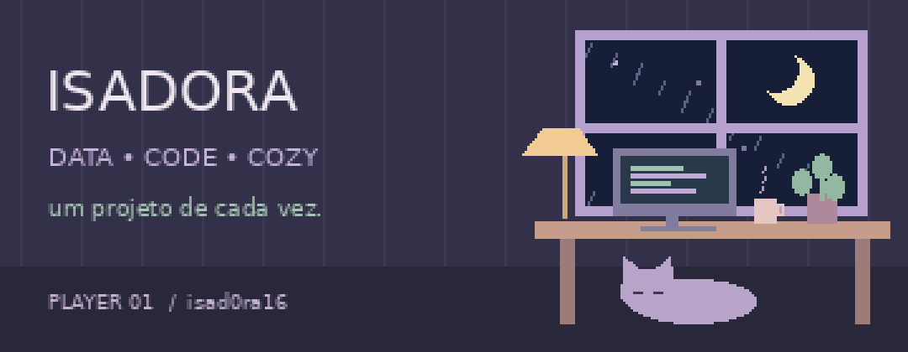
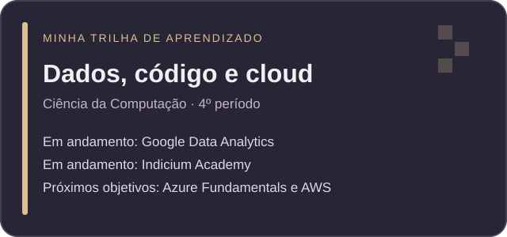
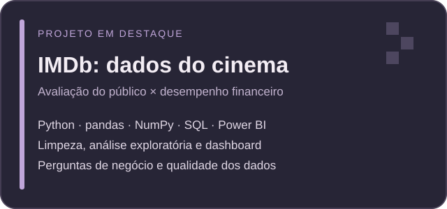
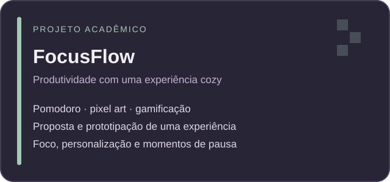

  

## 💜 Oi, eu sou a Isadora!

**Formada em Farmácia · estudante de Ciência da Computação · em transição para Análise e Engenharia de Dados**

### 🧭 Sobre mim

🎓 Curso **Ciência da Computação**, atualmente no **4º período**.

🔬 Minha formação em **Farmácia** faz parte da minha trajetória: levo para os projetos o cuidado com informações e o interesse em investigar evidências.

📊 Hoje, meu foco está em **Análise de Dados e Engenharia de Dados**, conectando perguntas de negócio, preparação de dados e comunicação de resultados.

🌱 Estou construindo meu portfólio com **Python, SQL e Power BI**, enquanto aprofundo meus estudos em bancos de dados, ETL e modelagem.

🎮 Gosto de jogos, séries e filmes. Por aqui, essa criatividade aparece em projetos e em uma estética lo-fi/cozy — café virtual sempre disponível. ☕

## 💼 O que desenvolvo nos meus projetos

▸ **Preparação de dados:** limpeza, padronização, tratamento de ausências e duplicidades.

▸ **Análise exploratória:** investigação de padrões, comparação entre grupos e estatística descritiva.

▸ **SQL e bancos relacionais:** consultas, joins e agregações para explorar informações.

▸ **Dashboards:** visualização e comunicação de resultados com Power BI.

▸ **Documentação:** explicação das decisões de tratamento e dos limites das análises.

## 🤝 Vamos nos conectar!

Gosto de trocar ideias sobre dados, tecnologia, estudos e transição de carreira.

<!-- Acrescente LinkedIn e e-mail profissional aqui se quiser publicá-los. -->

---

## 📚 O que estou estudando agora

  

| Em andamento | Foco |
| --- | --- |
| Ciência da Computação | Formação em computação e desenvolvimento da base técnica. |
| Google Data Analytics | Processo de análise e comunicação com dados. |
| Indicium Academy | Aprofundamento dos estudos em dados. |

**Próximos objetivos:** preparação para **Azure Fundamentals** e estudo dos fundamentos de **AWS**.

---

## 🗂️ Projetos em destaque

<table>
<tr>
<td width="50%" valign="top">

<h3>🎬 IMDb</h3>

Investigação da relação entre <b>nota, orçamento e receita</b> de filmes, orientada por perguntas de negócio.

Preparação com Python, pandas e NumPy, exploração com SQL e apresentação em um dashboard de quatro páginas no Power BI.

<b>Destaque:</b> atenção às inconsistências da base e à diferença entre padrões observados e conclusões comprovadas.

</td>
<td width="50%" valign="top">

<h3>🍃 FocusFlow</h3>

Projeto acadêmico que combina a proposta de <b>Pomodoro</b> com uma experiência inspirada em <b>cozy games e pixel art</b>.

Concepção e prototipação de uma experiência de foco, personalização de ambientes e gamificação.

<b>Destaque:</b> conexão entre tecnologia, criatividade e experiência do usuário.

</td>
</tr>
</table>

<!-- Inclua os links diretos dos projetos quando os endereços dos repositórios estiverem confirmados. -->

---

## 🛠️ Skills & ferramentas

Ferramentas que utilizo nos estudos e projetos:

**Na prática:** limpeza de dados · análise exploratória · consultas SQL · estatística descritiva · dashboards · documentação.

**Em aprofundamento:** ETL · pipelines · modelagem de dados · fundamentos de cloud.

---

## 🌱 Próximas conquistas

<table align="center">
<tr>
<td align="center" width="260">
<h3>☁️ Azure</h3>
<b>Azure Fundamentals</b>

Objetivo de preparação

Construir a base em serviços e conceitos de nuvem.
</td>
<td align="center" width="260">
<h3>☁️ AWS</h3>
<b>Fundamentos de AWS</b>

Próxima etapa de estudos

Explorar os conceitos e serviços da plataforma.
</td>
</tr>
</table>

<!-- Quando houver certificações conquistadas, substitua esta seção por imagens dos badges e links verificáveis das suas credenciais. -->

---

  
    
  <i>Aprendendo, construindo e compartilhando — um projeto de cada vez.</i>
    
  
   
  Obrigada pela visita ao meu cantinho. ☕🌿

<!--
PUBLICAÇÃO
Envie README.md e a pasta assets para a raiz do repositório público isad0ra16/isad0ra16.
Preserve os nomes dos arquivos para que GIFs e cards apareçam.
Atualize período, cursos e links conforme sua trajetória evoluir.
Os GIFs e cards acompanham o pacote. Badges e contador utilizam serviços externos.
VISITORS contabiliza visualizações, não pessoas únicas.
-->
<!--
**isad0ra16/isad0ra16** is a ✨ _special_ ✨ repository because its `README.md` (this file) appears on your GitHub profile.

Here are some ideas to get you started:

- 🔭 I’m currently working on ...
- 🌱 I’m currently learning ...
- 👯 I’m looking to collaborate on ...
- 🤔 I’m looking for help with ...
- 💬 Ask me about ...
- 📫 How to reach me: ...
- 😄 Pronouns: ...
- ⚡ Fun fact: ...
-->
